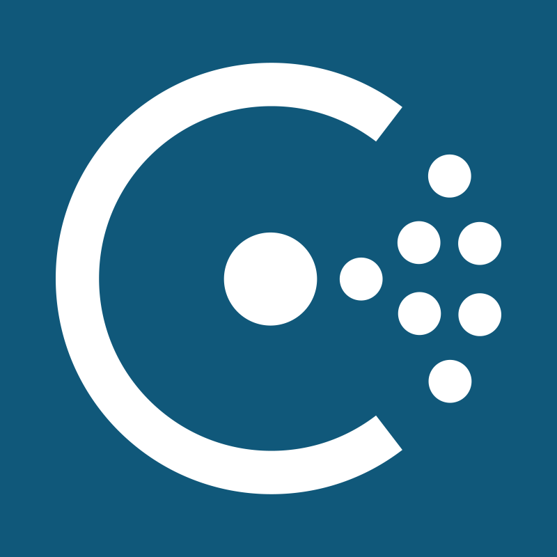
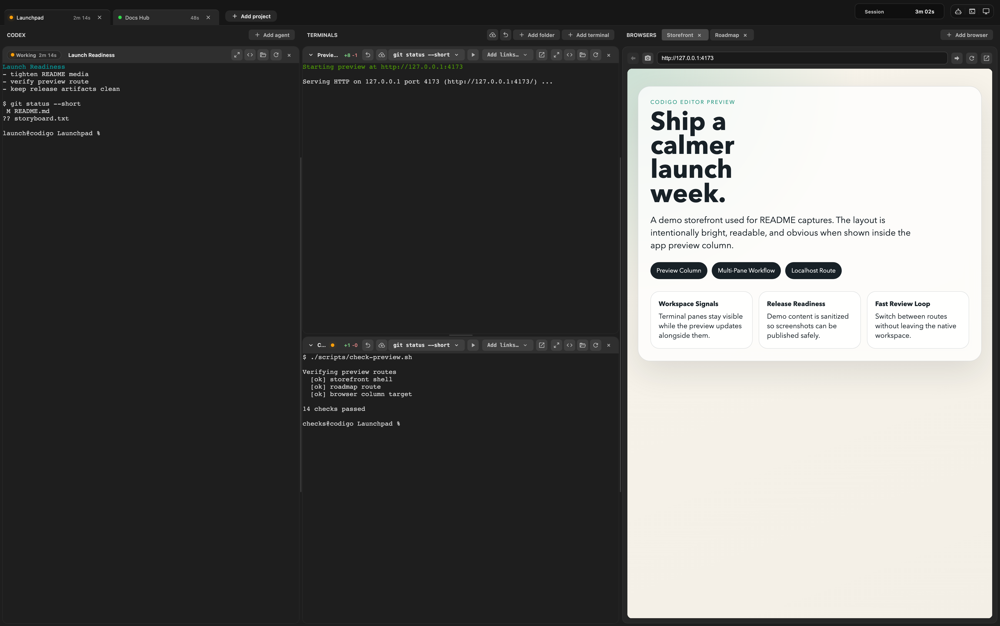
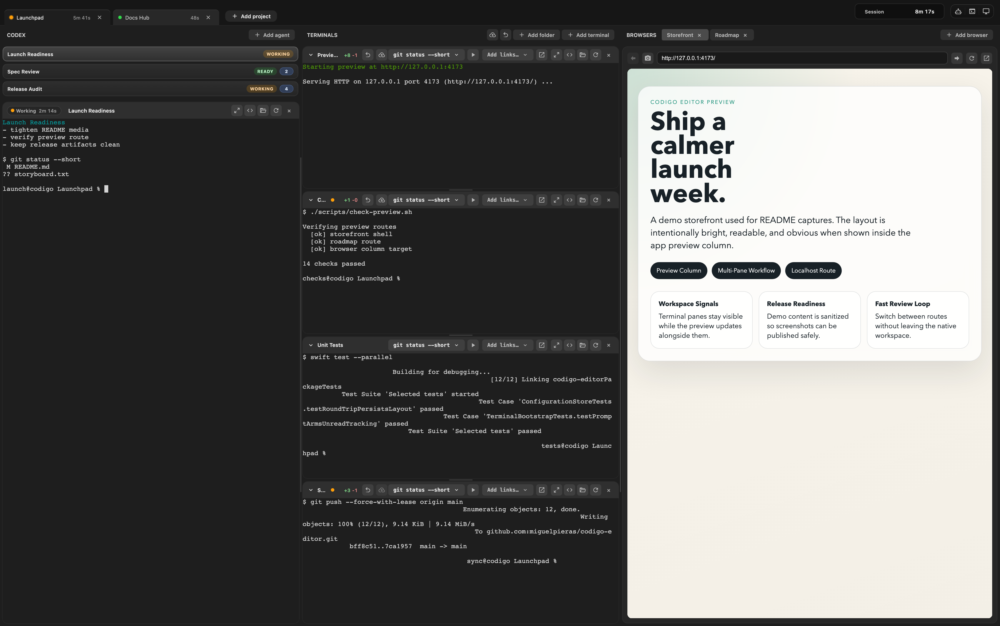
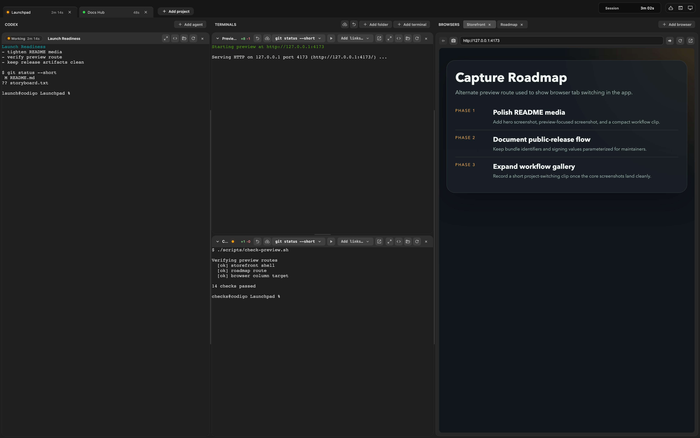
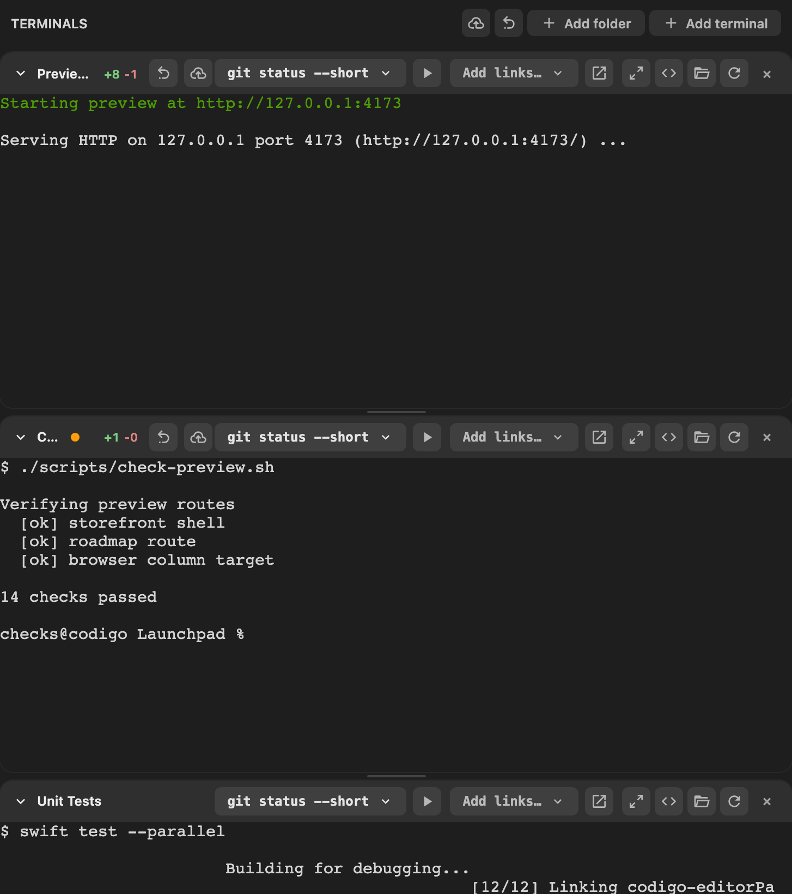
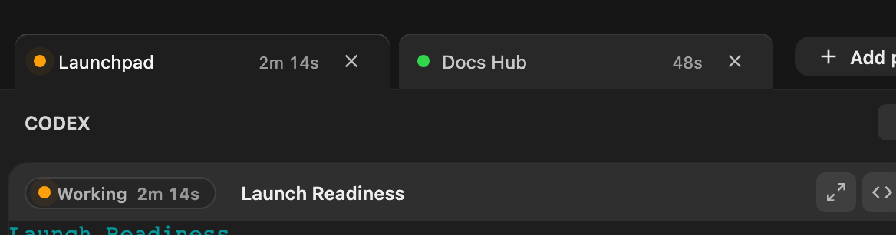
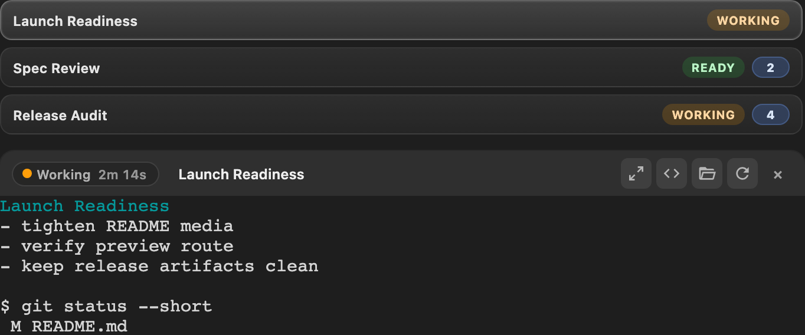

# Codigo Editor

<p align="center">
  
</p>

<p align="center">
  <strong>Native macOS workspace for terminal-first coding.</strong><br />
  Run agents, terminals, previews, and Git/GitHub flows in one window.
</p>

## Status

> Already usable, still evolving. Expect the UI and settings to keep moving.

## Feature Snapshot

<table>
  <tr>
    <td width="50%" valign="top">
      
      <br />
      <strong>Multi-pane workspace</strong>
      <br />
      <sub>Keep project tabs, terminal stacks, and previews visible together.</sub>
    </td>
    <td width="50%" valign="top">
      
      <br />
      <strong>Multiple agents</strong>
      <br />
      <sub>Run Codex, Claude Code, or custom launcher commands side by side.</sub>
    </td>
  </tr>
  <tr>
    <td width="50%" valign="top">
      
      <br />
      <strong>Built-in preview</strong>
      <br />
      <sub>Keep localhost routes open beside the terminal work that drives them.</sub>
    </td>
    <td width="50%" valign="top">
      
      <br />
      <strong>Git and GitHub helpers</strong>
      <br />
      <sub>Inspect changes, trigger sync flows, and hand off to your editor quickly.</sub>
    </td>
  </tr>
</table>

## Quick Start

1. Install the latest release or run `./run-app.sh`.
2. Pick a workspace folder.
3. Choose your default starter command in `Codigo Editor > Settings...`.
4. Add agents, stack terminals, and open a preview tab.

## In Action

The screenshots below use a sanitized demo workspace with fake project names, branches, prompts, and localhost routes.

### 1. Open a workspace

One window holds the project tab, terminal columns, and built-in preview.



### 2. Run multiple agents

Keep several Codex, Claude Code, or custom sessions live in the same project.



### 3. Keep localhost visible

Open preview tabs beside the terminal work that drives your app.



### 4. Stack background work

Use the secondary terminal column for checks, preview logs, sync flows, or tests.



### 5. Read activity fast

Tab color and timers show which projects are active and which ones are ready.



### 6. Switch sessions fast

The agent switcher makes unread output and active sessions obvious.



## Features

- Native macOS app built with AppKit, SwiftUI, WebKit, and xterm.js
- Multi-tab, multi-pane terminal layout for agents and shell sessions
- Configurable starter command for new panes such as `codex`, `claude`, or any custom command
- Built-in preview tabs for local web apps and dev servers
- Git status, change inspection, sync actions, and pull request helpers
- Editor hand-off actions, optional notifications, and JSON-backed local settings with XCTest coverage

## Requirements

- macOS 13 or newer
- A Swift 6.1-compatible toolchain (`swift --version`)
- `npm` for the bundled web UI asset pipeline

Optional tools:

- `gh` for GitHub sign-in, sync, and pull request flows
- `cursor` or `code` on your `PATH` if you want one-click editor hand-off

## Installation

### Install the packaged app

1. Open the [GitHub Releases page](https://github.com/miguelpieras/codigo-editor/releases).
2. Download the latest `CodigoEditor-<version>.dmg` or `.zip`.
3. Move `Codigo Editor.app` into `/Applications`.
4. Launch the app from Finder or Spotlight.

### Build from source

```bash
git clone https://github.com/miguelpieras/codigo-editor.git
cd codigo-editor
./run-app.sh
```

`./run-app.sh` handles dependency install, web asset build, app assembly, and launch unless `RUN_APP_SKIP_OPEN=1`.

By default, local packaging uses a neutral bundle identifier. If you are preparing a distributable build, set `CODIGO_BUNDLE_IDENTIFIER` to your own reverse-DNS identifier before running the packaging or release scripts.

Lower-level development flow:

```bash
npm install
npm run build
npm run sync-assets
swift build --configuration debug
swift test --parallel
```

Use `./run-app.sh` for the packaged `.app`, or the commands above when you want the lower-level build and test loop.

## Updates

- No in-app auto-updater yet.
- Release builds update by downloading the newest GitHub Release and replacing `Codigo Editor.app`.
- Maintainers generate release artifacts with `./Scripts/release.sh <version> [build]`.

For signed or notarized releases, provide your own Apple-specific values via environment variables such as `CODIGO_BUNDLE_IDENTIFIER`, `CODIGO_CODESIGN_IDENTITY`, `CODIGO_NOTARY_TEAM_ID`, `CODIGO_NOTARY_PROFILE`, `CODIGO_NOTARY_APPLE_ID`, and `CODIGO_NOTARY_PASSWORD`.

If you installed from source, update with:

```bash
git pull
./run-app.sh
```

Automatic updates would require a macOS updater such as Sparkle plus an appcast feed.

## Development

### Build

```bash
swift build --configuration debug
swift build --configuration release
```

### Run tests

```bash
swift test --parallel
```

### Build and verify the web UI

```bash
npm run build
npm run lint
```

### Launch the packaged app without opening it

```bash
RUN_APP_SKIP_OPEN=1 ./run-app.sh
```

## Project Layout

- `Sources/codigo-editor`: Swift application code
- `Sources/codigo-editor/Web`: TypeScript frontend for the terminal and preview UI
- `Sources/codigo-editor/Resources`: bundled assets shipped inside the app
- `Plugins/WebAssetsPlugin`: SwiftPM plugin for web asset generation
- `Tests/codigo-editorTests`: XCTest suite
- `Scripts/`: build, sync, release, and utility scripts

## Architecture

Codigo Editor is split into two main layers:

- A native macOS shell written in Swift/AppKit that manages windows, terminals, settings, persistence, notifications, and system integrations.
- A bundled TypeScript frontend rendered inside `WKWebView`, powered by `xterm.js`, that handles the pane-based terminal UI and preview experience.

This split keeps the app native where macOS integration matters, while allowing the terminal surface and layout logic to move quickly.

## Contributing

Issues and pull requests are welcome.

If you want to contribute, start with [CONTRIBUTING.md](CONTRIBUTING.md).

The short version:

1. Open an issue or discussion for larger changes.
2. Keep Swift and web changes validated with the relevant commands:
   - `swift test --parallel`
   - `npm run build`
   - `npm run lint`
3. Include UI screenshots or recordings when changing the app surface.

## License

[MIT](LICENSE)

Bundled third-party runtime notices are listed in [THIRD_PARTY_NOTICES.md](THIRD_PARTY_NOTICES.md).
